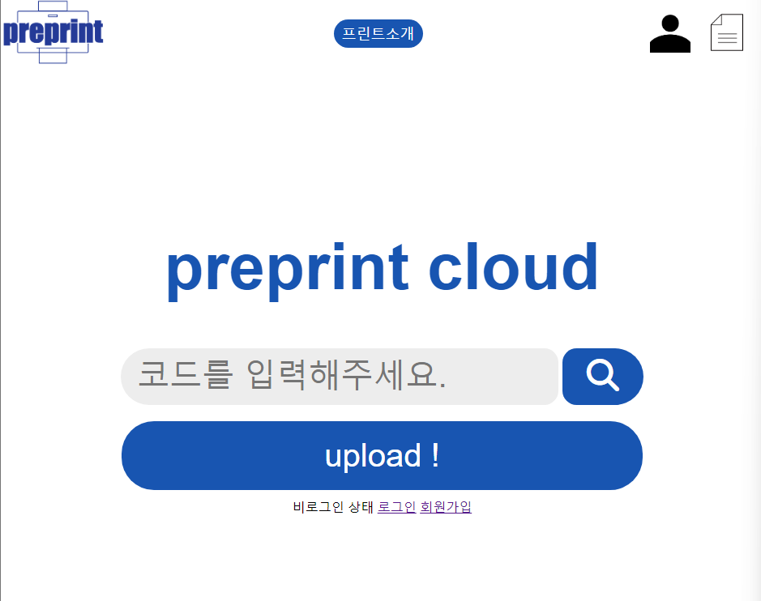



**preprint-cloud 소개 및 사용 설명서**

## **preprint-cloud 서비스**
-----
![ref0]

**preprint-cloud 서비스는 학생 회관 1층 preprint의 서브 프로젝트로 사용자의 파일 출력 및 관리의 편의성을 제공하는 서비스입니다.**

**기존 프린트 카페에서 파일을 출력하기 위한 매커니즘은 구글, 네이버 메일을 통해 미리 출력하고자 하는 파일을 전송 후 프린트 카페의 데스크탑에서 해당 소셜 플랫폼에 로그인 후 파일을 출력하는 방식입니다.**

**이런 방식은 사용자로 하여금 외부 환경에서 소셜 로그인을 진행하기에 보안의 측면에서, 편의성의 측면에서 불편함을 야기합니다.**

**preprint-cloud 서비스는 이와 같은 문제를 해결하고 사용자의 편의를 위하여 출력하고자 하는 파일을 웹 상에서 보관하고 이를 로그인 없이 파일 비밀번호로 검색 후 출력할 수 있도록 지원합니다.**

## **preprint-cloud 사용 방법**
-----
### **1. 회원가입**
![ref1]

⇒ **회원가입 버튼 클릭**

![ref2]

- **이미 존재하는 사용자의 이름의 경우 해당 이름 사용이 제한됩니다.**
- **비밀번호는 최소 8문자를 포함해야 합니다.**
- **비밀번호가 일상적인 단어이거나 모두 숫자로 이뤄진 경우 제한될 수 있습니다.**

**⇒ 정상적으로 회원가입을 완료해주세요**

### **2. 로그인**
![ref3]

**⇒ 회원가입한 계정으로 로그인을 진행해주세요**

### **3. 업로드**
**로그인이 완료된 상태일 때만 출력할 파일 등록을 진행할 수 있습니다.**

![ref4]

**⇒ 업로드 클릭**

![ref5]

**⇒ 파일 선택 버튼 클릭**

![ref6]

**⇒ 파일을 선택합니다.**

![ref7]

**⇒ 파일을 검색할 수 있는 파일 “비밀번호”를 함께 작성하여 업로드 합니다.**

**(이후 로그인되지 않은 상태에서 해당 파일을 검색할 수 있는 비밀번호 입니다.)**

### **4. 업로드 된 파일 확인**
![ref8]

⇒ **위 문서 아이콘 클릭 시 업로드한 파일의 정보를 확인할 수 있습니다.**

![ref9]

⇒ **동시에 최대 3개의 업로드만 보관할 수 있습니다.**

⇒ **원활한 서비스의 운영을 위해 이미 출력한 업로드 파일의 경우 등록 취소를 한 뒤 진행해주세요.**

⇒ **7일 이상 경과 된 업로드 파일은 자동 삭제됩니다.**

### **5. 등록한 파일 검색**
**파일 검색은 업로드 시 설정한 비밀번호로 검색 가능합니다.** 

**로그인을 진행하지 않은 상태에서도 검색이 가능합니다.**

![ref10]

⇒ **다음과 같이 업로드 시 설정한 비밀번호를 입력 후 검색 버튼을 클릭해주세요**

![ref11]

⇒ **다음과 같이 업로드한 파일과 관련 정보가 출력됩니다. 출력하고자 하는 파일을 클릭하고 아래와 같이 인쇄를 진행해주세요**

![ref12]

## **서비스 이용 중 오류 및 문제 수정 요청**
-----
**서비스 이용 중 오류, 문제 발견 시 아래 메일로 수정 요청을 보내주시면 빠른 시일 내 수정하도록 하겠습니다.**

**메일 주소: choiet4187@naver.com**

[ref0]: md_img/Untitled.png
[ref1]: md_img/Untitled1.png
[ref2]: md_img/Untitled2.png
[ref3]: md_img/Untitled3.png
[ref4]: md_img/Untitled4.png
[ref5]: md_img/Untitled5.png
[ref6]: md_img/Untitled6.png
[ref7]: md_img/Untitled7.png
[ref8]: md_img/Untitled8.png
[ref9]: md_img/Untitled9.png
[ref10]: md_img/Untitled10.png
[ref11]: md_img/Untitled11.png
[ref12]: md_img/Untitled12.png

